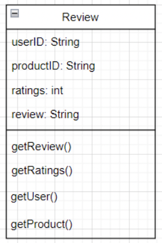
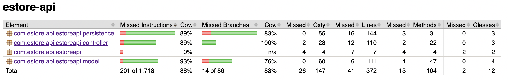

# Spoiled Milk Design Documentation
​
## Team Information
* Team name: Spoiled Milk
* Team members
  * Yaro Khalitov
  * Jeremy Smart
  * Daniel Jara
  * Nate Saunders
  * Jerry Chen
​
## Executive Summary

>We will make a functional e-store with different features based on whether the user is an admin or a customer.
​
### Purpose
>This project will allow users to access a spoiled milk e-store. An admin will be able to edit products in the inventory as well as add and remove products from the inventory. The customer will be able to view items from the dashboard and add/delete spoiled milks in their shopping cart. They will also be able to purchase these products.
​
### Glossary and Acronyms
​
>| Term | Definition |

>| SPA | Single Page |

>| MVP | Minimum Viable Product |

>| UI | User Interface |

>| MVVM | Model-View-ViewModel |

>| HTML | HyperText Markup Language |

>| CSS | Cascading Style Sheets |

​
​
## Requirements
  >* A user will have access to a login page where they can log in either as a customer or an admin
  >* A customer will have access to a shopping cart where they can add or remove products
  >* An admin will have access to an inventory where they can add, update, or delete products
  >* A customer will have access to a dashboard where they can view the spoiled milks and add it to their shopping cart.
  >* A customer will have an option to purchase the products they add to their shopping cart.
​
### Definition of MVP
  >* A user is able to log in to the e-store using a username and password
  >* A customer is able to purchase milks from the e-store. 
  >* An admin can edit the inventory based on which milks are available to purchase
​
### MVP Features
>* Minimal Authentication for customer/owner login.
  >* Customer can see list of products.
  >* Customer can search for a product.
  >* Customer can add/remove an item to their shopping cart.
  >* Customer can proceed to check out their items for purchase.
  >* E-Store owner can add, remove or delete items in the inventory.
  >* Implementation of enhancements
​
### Enhancements
> We have two enhancements:
  >* A rating system, where customers can rate a products out of 5
  >* A password system, where a customer or admin can log in with a username and password
​
​
## Application Domain
​
This section describes the application domain.
​

​
​
​
## Architecture and Design
​
>This section describes the application architecture.
​
### Summary
​
>The following Tiers/Layers model shows a high-level view of the webapp's architecture.
​

​
The e-store web application, is built using the Model–View–ViewModel (MVVM) architecture pattern. 
​
The Model stores the application data objects including any functionality to provide persistance. 
​
The View is the client-side SPA built with Angular utilizing HTML, CSS and TypeScript. The ViewModel provides RESTful APIs to the client (View) as well as any logic required to manipulate the data objects from the Model.
​
Both the ViewModel and Model are built using Java and Spring Framework. Details of the components within these tiers are supplied below.
​
​
### Overview of User Interface
​
>This section describes the web interface flow; this is how the user views and interacts
with the e-store application.
​
​
### View Tier
> We have components for App, Dashboard, Login, Milk-detail, Milk-detail-customer, Milk-search, Milks, and Shopping Cart.
>
> Upon opening up the program, the user is greeted with the Login page. This displays the text boxes to enter the username and the password and three buttons: Forgot Password?, Login, and Sign Up. Forgot Password? and Login and Sign Up, if the information entered is invalid, will not leave the page.
>
> If a **customer** successfully signs up or logs in, they are sent to Dashboard. This displays three buttons (Dashboard, Logout, and a Shopping Cart), a search bar from Milk-search, and all available milk items as a card, each with an Add to Cart button, some details about the item, including quantity in stock, and a picture.
>
> Clicking on the milk will send the customer to Milk-detail-customer for this milk. This presents some more information about the milk, including the rating, id, type, flavor, volume per unit, units available, and price per unit. The picture is shown under it and below are buttons to rate the milk and to Go Back. The rating buttons add a rating and the displayed rating will changed depending on the ratings, but will remain on the page. Go Back will send the customer back to the Dashboard.
>
> The Dashboard button on the top sends the user back to the Dashboard from whatever page they are on. The Add to Cart button in the milk card removes a milk from the available quantity and adds it to the customer's cart, greying out if there are no more milks left to buy. The shopping cart button sends the customer to Shopping Cart.
>
> Shopping Cart displays any milks currently in the customer's shopping cart with buttons to increment or decrement the quantity, a text box to input a delivery address, the total cost of the cart, and a Purchase button. Decrementing the entire quantity of a milk in the cart will remove it from view, and clicking the Purchase button will show an alert with the details of the address and the price of the purchase before removing all items from the cart. Both keep the user on the page.
>
> Logout will send the user back to Login. If the **admin** successfully logs in, they are sent to Milks. Milks displays a Milks button and Logout button on the top, which sends the admin to the Milks page or logs them out respectively, several text boxes for each detail of a milk, a Choose File button, an Add milk button, and all milks currently in the system with an X button. The X button will delete that milk from the store and clicking on the milk will send the admin to Milk-detail.
> 
> Milk-detail displays several text boxes, each holding one detil of the milk, and several buttons: Clear Ratings, Choose File, Go Back, and Save. Save and Go Back both send the admin back to Milks. The text boxes, Clear Ratings, and Choose File don't lead anywhere and only modify details of the milk.
> 
> Entering information into the text boxes in Milks and clicking Add milk creates a new milk product with those details. The Logout button logs the user out, sending them back to Login.
> 
> The sequence diagram for the Login function is shown below
>

> The sequence diagram for adding an item to a cart is shown below.

​
### ViewModel Tier
> We have a Controller class for Login, Milk, and Shopping Cart routes. Their UML diagrams are shown below.
>

​
### Model Tier
> We have a model for login, shopping cart, and the milk object itself. The UML diagrams is shown below.
> 

## OO Design Principles
**Controller**

>When it comes to our estore, we should be using more than just one controller. Several
functions don’t relate to each other well enough to be contained within just one, so our current
design will be implementing several. One section of our store that should use its own controller
is the log-in page. The UI controller would communicate with a log-in controller to perform
tasks, such as creating new accounts, checking to see if a password matches with the user, and
checking if the user in question has admin access. Another controller could be used for the
navigation of the store itself. Taking commands from the UI, a controller for the main page
would control which pages are being shown. The last main controller that should be on our list is
one for the list of products. Being mostly contained in a single page, there is a lot of functionality
on the list of those products, including the ability to, potentially, interact with the main page
controller to change pages to the selected product.
This is our current design, and I believe there could be some improvements to be made.
For one, there was not too much involvement in terms of working with data storage. It is unclear
how we intend on going about this, but I was thinking a controller for data submission and
retrieval would be a good way to go about it. For example: when a user adds a review on a
particular product, the UI controller should be able to call the data controller to add that review
to the data storage system, most likely to not be a database. This same controller could also be
used to create new users. It could take the data to be added as well as the destination file to add
to so that it can be used frequently. Additionally, there could also be a controller that can only be
accessed by admins used to manage the inventory of products. This could potentially work with
the controller for manipulating data, as it would update the data of the inventory as changes are
made. Below is an image of the different controllers that could interact with the UI.

**Single Responsibility**

>With single responsibility, many classes will be made to perform specific tasks. One
quickly distinguishable class is the Product class. This class specifically holds the data for
products, including the flavor, size, and age of the product. As also stated earlier, specific classes
for controlling the site can also be used. Site navigation can be limited to at least one class, and
the same can be said for logging in and product lists. Also, however, functions specific to
account information can be held within an Account class. After properly logging in, an Account
object would be accessed, and information from it will be used by it. The user should be able to
edit passwords and other information, while also having a ShoppingCart object attributed to it.
The ShoppingCart object would manage the functions of a shopping cart and hold Product
objects. ShoppingCart objects should be able to add and remove products from its array of
products, sending the array to the checkout page once the user is ready to purchase.
Another thing that we can do to better show this practice is to have more controllers for
specific functions. Another addition could be a checkout controller that manages the process of
checking out. Alternatively, however, it would also be possible to split up something larger into
different responsibilities, each one with a class to handle it. An example of this in action would
be splitting up the data controller into their respective data types. For example, there would be
one controller to handle the saving of accounts in a text file while another works on saving
Review objects in a review text file. The usage of a Review object would also follow this
practice, as instead of using the data controller to read and write from a review text file, a
Review object would hold the attributes of the ratings, the text review itself, the id account who
made the review, and the id of the product the review was left on. All of this can be organized
into a single class, which would give it the sole responsibility of being able to be accessed, read,
and edited. Below is a rough example of what a review object would look like.

**Open/Closed**

>The principle of open/closed states that software entities should be open for extension but
closed for modification. A good example of this is inheritance, interfaces, and polymorphism. A
class should only be designed for one purpose (as stated by single responsibility) and should be
polished to do that one thing. Adding or changing things to it would not make it closed for
modification. In our spoiled milk e-store project we are designing it in such a way that we do not
create redundant code and instead make use of OOP and OOD principles. For example, we will
have a general product class that will define base things like price, quantity, and name. From that
,we can create children classes that will build upon that adding other special product qualities. In
this way, we do not modify the base class but instead, open it up for extension. The extension of making multiple milk objects is possible without modifying the base class. If possible, making use of polymorphism will also be great to adhere to this principle. Perhaps we as a team should consider creating an abstract class that defines the final prices for each product. This way
in a different class we can call upon the price class without modifying anything else in that
different class. Adding these little changes will help our project be better and adhere to this
principle.

**Pure Fabrication**

>Pure fabrication principle states that in order to support single responsibility and low
coupling, a non-domain entity should be created when necessary. This principle focuses on
creating artificial entities (when necessary) that are not necessarily part of the domain object but
instead do some of the work that the domain objects should not. This will be vital when storing
inventory data of our products. We do not want the product classes to also perform storage of the
data. This should be done by a separate class where we can store our milk objects in a file or something
similar. This helps enable our entities to stay within their single responsibility domains, and
encourages low coupling. I think for our current design we should definitely consider adding
more stories on trello for entities such as these. The inventory entity is one example, but we
should also consider doing it for the login page too. It's easy to sometimes start implementing
stuff without thinking ahead, so we want to discourage that when working on our project.

​
​
## Static Code Analysis/Future Design Improvements
> One issue that occurred in our milk-app project which tested our TypeScript code was in the file: src/app/milk-detail-customer/milk-detail-customer.component.ts. In our rateMilk() function, it flagged three errors which said, ‘Unexpected var, use let or const instead.’ Our analysis reports that there is a significant distinction between the variable types created by var and by let. A switch to let would help alleviate many of the variable scope issues we’ve seen in our project. An easy way to fix this is simply to switch out the instances where we used var with const, similarly to how we used const in our getMilk() function just above the rate function. Another issue within our milk-app was in the file: src/.../java/com/estore/api/estoreapi/persistence/LoginFileDAOTest.jav. When testing our login and signup components, it flagged twice that we should have combined the three login tests into a single parameterized one, as well as the three signup tests. Since our multiple tests differ only by a few hardcode values, if given more time we should have refactored them into two parameterized tests, one to test all the login components and one to test the signup components. A third issue was flagged in our estore-api which tested our Java code in the file: src/.../java/com/estore/api/estoreapi/persistence/MilkFileDAO.java. In our load() function, the error states to ‘Make the enclosing method “static” or remove this set.’ If given the proper time, our team should look into this issue and analyze how to correct this. The report states that correctly updating a static field from a non-static method is tricky to get right and could lead to bugs but will continue to raise an issue each time a static field is updated from a non-static method. Overall, our team produced a project with very few errors and if given more time I would recommend we correct any little issues that don’t seem important to really produce a polished, high end project.

​
## Testing
> _This section will provide information about the testing performed
> and the results of the testing._
​
### Acceptance Testing
> All of our user stories have passed the acceptance tests.
​
### Unit Testing and Code Coverage
> We have included unit testing for our model, persistence, and controller. Our code coverage is 88%. We could have done some more unit testing on the shopping cart classes to bring the code coverage higher.
​
